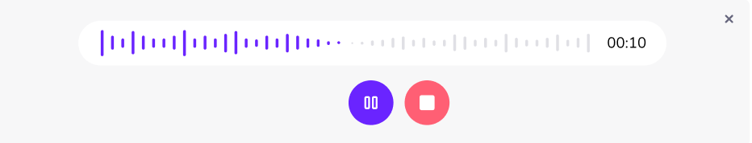

# @meersagor/wavesurfer-vue

[](https://www.npmjs.com/package/@meersagor/wavesurfer-vue)
[](https://opensource.org/licenses/MIT)


## Audio Player


A Vue 3 component for [wavesurfer.js](http://github.com/katspaugh/wavesurfer.js). This component simplifies the usage of wavesurfer.js in Vue.js, with all familiar wavesurfer options available as Vue props.

You can subscribe to various [wavesurfer events](https://wavesurfer.xyz/docs/types/wavesurfer.WaveSurferEvents) via props. Simply prepend an event name with 'on', e.g., `ready` -> `@ready`. Each event receives a wavesurfer instance as the first argument.


## Installation

With yarn:
```bash
yarn add @meersagor/wavesurfer-vue
```

With npm:
```bash
npm i @meersagor/wavesurfer-vue
```

## Usage

As a component:

```vue
<script setup lang="ts">
import { ref } from 'vue'
import type WaveSurfer from 'wavesurfer.js'
import { WaveSurferPlayer } from '@meersagor/wavesurfer-vue'


const options = ref({
  height: 48,
  waveColor: 'gray',
  progressColor: 'red',
  barGap: 5,
  barWidth: 5,
  barRadius: 8,
  duration: 80,
  url: "https://revews-bucket.s3.ap-southeast-1.amazonaws.com/a06mmMU3sgnzuUkH4OiHvyuUgCFdLSnJaDLBao7y.webm",
})

const currentTime = ref<string>('00:00')
const totalDuration = ref<string>('00:00')
const waveSurfer = ref<WaveSurfer | null>(null)

const formatTime = (seconds: number): string => [seconds / 60, seconds % 60].map((v) => `0${Math.floor(v)}`.slice(-2)).join(':')

const timeUpdateHandler = (time: number) => {
  currentTime.value = formatTime(time)
}
const readyHandler = (duration: any) => {
  totalDuration.value = formatTime(duration)
}
const readyWaveSurferHandler = (ws: WaveSurfer) => {
  waveSurfer.value = ws
}
</script>

<template>
  <main>
    <h1>WaveSurferPlayer Using Components </h1>
    <WaveSurferPlayer :options="options" @timeupdate="(time: number) => timeUpdateHandler(time)"
      @ready="(duration: number) => readyHandler(duration)" @waveSurfer="(ws: WaveSurfer) => readyWaveSurferHandler(ws)" />
    <p> currentTime: {{ currentTime }}</p>
    <p>totalDuration:{{ totalDuration }}</p>
    <button @click="waveSurfer?.playPause()" :style="{ minWidth: '5em' }">
      Play
    </button>
  </main>
</template>
```

Alternatively, as a vue composable method:

```vue
<script setup lang="ts">
import { ref } from 'vue'
import {useWaveSurfer} from '@meersagor/wavesurfer-vue'
const containerRef = ref<HTMLElement | null>(null)
const options = ref({
  height: 48,
  waveColor: 'gray',
  progressColor: 'red',
  barGap: 5,
  barWidth: 5,
  barRadius: 8,
  duration: 80,
  url: "https://revews-bucket.s3.ap-southeast-1.amazonaws.com/a06mmMU3sgnzuUkH4OiHvyuUgCFdLSnJaDLBao7y.webm",
})

const {waveSurfer, currentTime, totalDuration} = useWaveSurfer({containerRef, options: options.value})

const formatTime = (seconds: number):string => [seconds / 60, seconds % 60].map((v) => `0${Math.floor(v)}`.slice(-2)).join(':')
</script>

<template>
  <main>
    <h1>WaveSurferPlayer Using Composeable Method </h1>
    <div ref="containerRef"></div>
    <p>currentTime: {{formatTime(currentTime)}}</p>
    <p>totalDuration:{{formatTime(totalDuration)}}</p>
    <button @click="waveSurfer?.playPause()">
      Play
    </button>
  </main>
</template>
```

## Audio Recorder




## use useWaveSurferRecorder composable method

```vue
<script lang="ts" setup>
import { computed, ref } from 'vue'
import { useWaveSurferRecorder } from '@meersagor/wavesurfer-vue'
const showAudioRecordButton = ref<boolean>(true)
const containerRef = ref<HTMLDivElement | null>(null)

const options = computed(() => ({
    height: 48,
    waveColor: "#66667D",
    progressColor: "#6A24FF",
    barGap: 5,
    barWidth: 5,
    barRadius: 8,
    cursorWidth: 0,
    url: "https://revews-bucket.s3.ap-southeast-1.amazonaws.com/a06mmMU3sgnzuUkH4OiHvyuUgCFdLSnJaDLBao7y.webm",
}))

const { pauseRecording, startRecording, stopRecording, currentTime, isPauseResume } = useWaveSurferRecorder({
    containerRef,
    options: options.value,
      recordPluginOptions:{
        continuousWaveform: true
      }
})

const startAudioRecordHandler = () => {
    startRecording()
    showAudioRecordButton.value = false
}

const stopHandler = async () => {
    const blob = await stopRecording()
    console.log('blob =====', blob);
    showAudioRecordButton.value = true
}
</script>

<template>
    <div>
        <div>
            <div ref="containerRef"></div>
        </div>
        <p>{{ currentTime }}</p>
        <button v-if="showAudioRecordButton" @click="startAudioRecordHandler"> Start Recording </button>
        <div v-else>
            <button @click="pauseRecording">{{ isPauseResume ? 'pause' : 'resume' }}</button>
            <button @click="stopHandler">Stop</button>
        </div>
    </div>
</template>
```
## useWaveSurferRecorder: method Return Types
### `waveSurfer`

-   Type: `Ref<WaveSurfer | null>`
-   Description: A ref containing the instance of the `wavesurfer.js` player.

### `waveSurferRecorder`

-   Type: `Ref<RecordPlugin | null>`
-   Description: A ref containing the instance of the `wavesurfer.js` record plugin.

### `currentTime`

-   Type: `ComputedRef<string>`
-   Description: A computed ref representing the current recording time in `mm:ss` format.

### `isPaused`

-   Type: `ComputedRef<boolean | undefined>`
-   Description: A computed ref indicating whether the recording is currently paused.

### `isRecording`

-   Type: `ComputedRef<boolean | undefined>`
-   Description: A computed ref indicating whether the recording is currently in progress.

### `startRecording()`

-   Type: `() => void`
-   Description: Method to start or resume the recording process. If recording is already in progress, it stops and starts a new recording.

### `stopRecording()`

-   Type: `() => Promise<Blob>`
-   Description: Method to stop the recording process and return the recorded audio as a `Blob` object.

### `pauseRecording()`

-   Type: `() => void`
-   Description: Method to resume a paused recording. If recording is not paused, it toggles between pause and resume.


## Docs

https://wavesurfer.xyz

If you have any specific preferences or additional changes you'd like, feel free to PR

